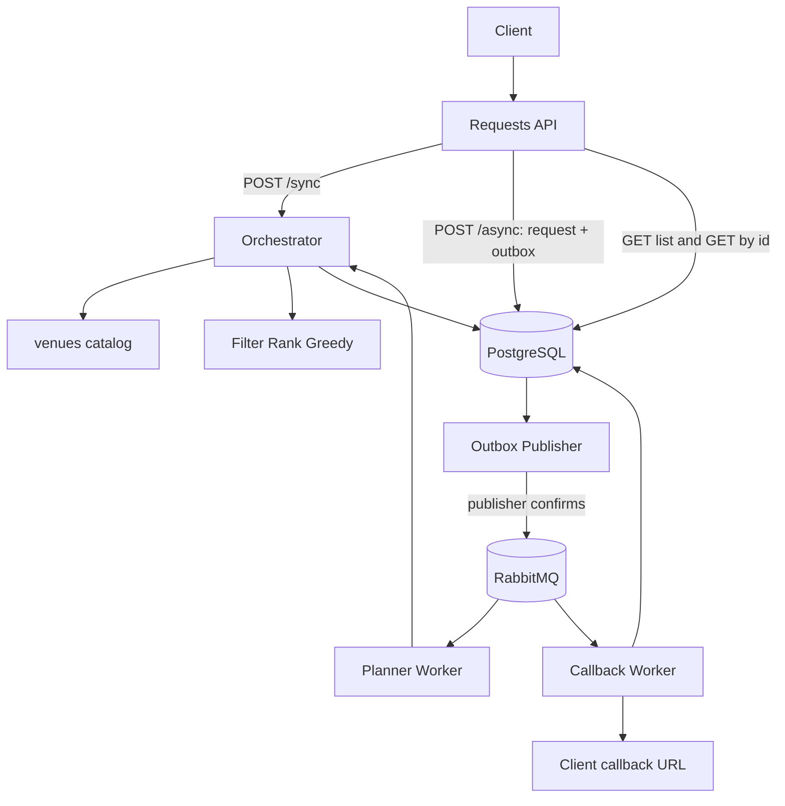
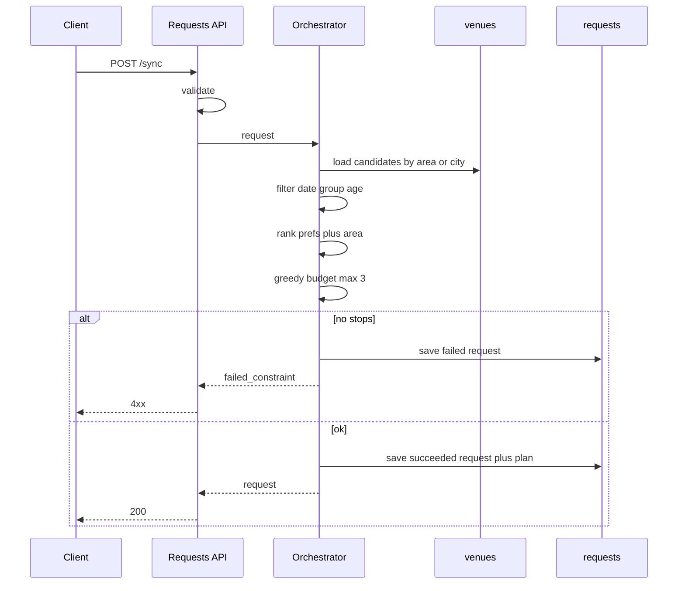
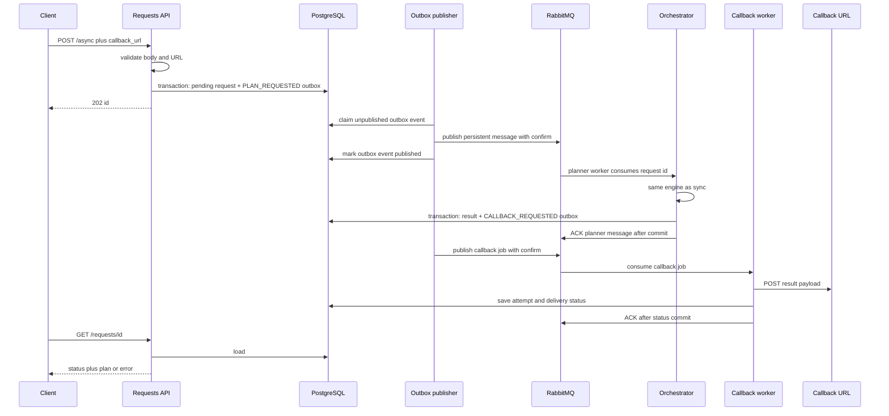

# Outing Planner — High Level Design (draft v5)

**Product (one line):** Given location, date, group size, budget, preferences, and an **age range**, return a same-day outing plan in Bangalore that fits those constraints.

This document is HLD only. Exact JSON, tables, and scoring weights belong in LLD.

---

## 1. Problem

A user wants a short outing (up to three stops) in Bangalore. They tell us where they are starting from, which day, how many people, how much they can spend, what they like, and **who the outing is for as an age range** (youngest and oldest), e.g. 5–10, 11–15, 16–20, 21+.

The system should not invent places. It should pick from a **known catalog** of Bangalore venues and apply the **same small set of rules** every time.

Clients may want the plan **immediately** (sync) or **submit and check later** (async: callback plus `GET /requests/{id}`). Generate and read APIs share one **request** resource. One engine.

**Example**

- Input: Koramangala, Saturday, 4 people, **age_min 21 / age_max 35**, budget ₹4000, prefs `food`, `cafe`
- Output: three stops (e.g. cafe → lunch → dessert), total ≤ ₹4000, each venue can host 4 people and is suitable for **everyone from 21 through 35** (no kids-only park, no “max age 18” venue).

---

## 2. Scope

### In scope (v1)

- Bangalore only.
- HTTP surface from the problem doc, plus generate:
  - **Sync create:** `POST /sync`.
  - **Async create:** `POST /async` (same planner, different delivery path).
  - **List:** `GET /requests?mode=sync|async`
  - **Get one:** `GET /requests/{id}`
  - **Health:** `GET /healthz`
- Catalog of ~30–50 venues stored in our database.
- Up to **3 stops**, greedy pick after filter + rank.
- Python backend (framework choice belongs in LLD).
- PostgreSQL for the venue catalog, request state, results, callback audit, and transactional outbox.
- RabbitMQ for durable planner and callback job delivery.
- A load generator for sync and async request storms, including a local callback receiver and summary statistics.
### Assumptions

| Topic         | Decision                                                                                                                                                                 |
| ------------- | ------------------------------------------------------------------------------------------------------------------------------------------------------------------------ |
| City          | Catalog is Bangalore. Unknown / out-of-city location → reject.                                                                                                           |
| Location      | Bangalore area name only (for example, `Indiranagar`). Unknown areas are rejected.                                                                                   |
| Area fallback | If the requested area has too few valid venues, consider the full Bangalore catalog and rank same-area venues first.                                                 |
| Budget        | **Total for the group**, INR. Does not include transport.                                                                                                                |
| Date          | Used as weekday vs weekend vs venue `open_days`. Not hour-by-hour.                                                                                                       |
| Group size    | Number of people. Used only as capacity (`n <= venue.capacity`).                                                                                                         |
| Age           | **Range on the request:** `age_min` and `age_max` (inclusive years). Example bands clients can send: 5–10, 11–15, 16–20, 21–99. A single person is `age_min == age_max`. |
| Cost on venue | Estimated spend for the **whole group** at that stop (same unit as budget).                                                                                              |
| Determinism   | Same input + same catalog → same plan (no randomness in v1).                                                                                                             |
| Preferences   | Preference tags affect ranking only; zero tag overlap does not fail an otherwise valid plan.                                                                             |
| Async         | `POST /async` needs `callback_url`. Client can also **poll** `GET /requests/{id}`.                                                                                       |
| Delivery      | RabbitMQ delivery is at least once; workers are idempotent. The stored request returned by `GET /requests/{id}` is authoritative.                                       |
| Request list  | `mode` is required on `GET /requests`; results use bounded cursor pagination.                                                                                             |

---

## 3. Functional requirements

Original problem (both APIs): location, date, group size, **age range**, budget, preference tags.

1. Produce a plan: ordered stops, per-stop cost, total cost, leftover budget.
2. If nothing fits, surface `failed_constraint`: `date` | `group_size` | `age` | `budget` | `location`.
3. Persist every generate call as a **request** row (mode, status, result) so list/get work.

### HTTP API (v1)

Same constraint body for create: location, date, group size, age range, budget, preference tags.

| Method | Path                        | Role                                                                                                                                                      |
| ------ | --------------------------- | --------------------------------------------------------------------------------------------------------------------------------------------------------- |
| `POST` | `/sync`                     | Generate and **wait**. `200` + request (with plan) or `4xx` + `failed_constraint`. Row is stored with `mode=sync`.                                        |
| `POST` | `/async`                    | Same body + `callback_url`. `202` + `id` (`status=pending`). Engine runs in background; we POST result to callback. Client may poll `GET /requests/{id}`. |
| `GET`  | `/requests?mode=sync|async` | **List** past requests of that mode (summaries). `mode` is required.                                                                                      |
| `GET`  | `/requests/{id}`            | **Get one** request: input snapshot, status (`pending` / `processing` / `succeeded` / `failed`), plan or error.                                           |
| `GET`  | `/healthz`                  | Process and PostgreSQL health plus RabbitMQ connectivity status. `200` when required dependencies are healthy.                                          |

`mode` on GET list is only a **filter**. Create mode is determined by the explicit `/sync` or `/async` endpoint.

The two POST handlers share request models, validation, orchestration, planner logic, persistence, and result models. Only acknowledgement and delivery behavior differ; do not copy-paste business rules.

Unknown `mode` → `4xx`. Missing request id → `404`.

### Non-functional

- Sync: target p95 < 500 ms locally.
- Async: target p95 acknowledgement < 100 ms locally when capacity is available; callback timing is measured separately.
- Survive the documented load-test profile without crashing or creating unbounded work.
- Apply bounded concurrency, queue capacity, body-size limits, DB/HTTP connection limits, and timeouts.
- Return `429 Too Many Requests` (with `Retry-After`) when the configured async backlog threshold is reached; do not create a request row for rejected work.
- Persist enough timestamps and callback-attempt information to trace an async request end to end.
- No third-party keys in v1.
- Age is not DOB; input is `age_min` / `age_max`; do not log more location than needed.

---

## 4. Core design choice

**Catalog is data. Rules are generic.**

We do **not** store “if age 5–10 then Plan A”. Each venue has attributes (`min_age`, `max_age`, `capacity`, `open_days`, `tags`, `cost`, `area`). One engine:

1. Filter (hard)
2. Rank (soft)
3. Greedy pick until 3 stops or budget/list ends

Request `5–10` vs `21–99` get different plans because **different rows survive the filter**, not because we shipped two scripts.

**Age range vs venue range:** keep a venue only if it is OK for the **whole** requested span:

`venue.min_age <= request.age_min` **and** `venue.max_age >= request.age_max`

So 11–15 does not get a 5–12 playground (15 is too old) or a 21+ pub (11 is too young).

**Delivery is separate from planning:** sync vs async only changes *when* and *where* the result is sent.

---

## 5. High-level architecture

v1 is one modular application with API, outbox-publisher, planner-worker, and callback-worker runtime roles. The local Docker setup combines the three worker roles in one worker container while keeping their handlers separate. PostgreSQL and RabbitMQ run as local infrastructure containers.

| Piece             | Role                                                                                         |
| ----------------- | -------------------------------------------------------------------------------------------- |
| Requests API      | Create (sync/async), list, get, health.                                                  |
| PostgreSQL        | Venues, requests, results, callback audit, and outbox events.                              |
| Outbox publisher  | Publishes committed events to RabbitMQ and records publisher-confirmed delivery.           |
| RabbitMQ          | Durable planner/callback queues, delayed retry queues, and dead-letter queues.              |
| Planner worker    | Consumes planner jobs and invokes the shared orchestrator idempotently.                    |
| Callback worker   | Delivers callbacks with bounded retries independently of planner capacity.                |
| Catalog           | Bangalore venues stored in PostgreSQL.                                                     |
| Rule engine       | Filter → rank → greedy 3 stops. Shared by sync and async paths.                            |
| Callback endpoint | Receives async notification; **GET by id** remains the authoritative read.                 |

For `/async`, the API writes the `pending` request and `PLAN_REQUESTED` outbox event in one PostgreSQL transaction, then returns `202`. The outbox publisher sends the request ID to a durable RabbitMQ queue using persistent messages and publisher confirms. This removes the database-to-broker dual-write gap.

Planner and callback workers use manual acknowledgements and bounded prefetch. A worker acknowledges a message only after its database changes commit. Unacknowledged messages are redelivered after worker failure, so handlers must be idempotent. Retry queues use delayed redelivery; messages that exceed the configured attempt limit move to a dead-letter queue and are reflected in persisted status.

---

## 6. Request flow

### 6.1 Sync (`POST /sync`)

Happy path:

1. Validate types and ranges (`1 <= age_min <= age_max`, group size ≥ 1, budget > 0, location in Bangalore).
2. Load candidate venues (all city, or prefer the user’s area first).
3. **Hard filter:** `open_days` matches date; `capacity >= group_size`; `venue.min_age <= age_min` and `venue.max_age >= age_max`.
4. **Rank:** more preference-tag overlap wins; then same-area venues; then venue ID for deterministic ties.
5. **Greedy:** walk the ranked list; take a venue if `cost <= remaining_budget`; stop at 3.
6. If zero stops: fail with `budget` if the list was non-empty after step 3 but every cost was too high; otherwise the filter that emptied the list.
7. Save and return.

`POST /sync` invokes the planner once. It does not publish to RabbitMQ and the backend does not retry the complete sync operation. A transient database or server failure is returned to the client as `503` or `500`; the client decides whether to submit a new request.

### 6.2 Async (`POST /async` + callback + GET)

Callback body should match the stored request result (plan or `failed_constraint`) plus `id`. The result and completion timestamp are committed before callback delivery starts.

**Callback delivery (v1):** callback work uses a separate RabbitMQ queue so a slow destination cannot consume planner capacity. Each attempt has fixed DNS/connect/read timeouts. Retry transient network errors, `408`, `429` (respecting `Retry-After` within configured bounds), and `5xx` responses with bounded exponential backoff. Do not retry other `4xx` responses. After the maximum attempts, dead-letter the job and mark callback status `dead_lettered`. Record every attempt, duration, HTTP status or error category. Planning status remains independent of callback status, and the client can always use `GET /requests/{id}`.

Callbacks are delivered at least once and can arrive more than once or out of submission order because workers run concurrently and failed messages are retried. Consumers must correlate on `id` and treat it as an idempotency key. No global callback-order guarantee is provided.

**Callback safety / SSRF:** require `https` outside local development; allow only standard ports unless configured; resolve the hostname and reject loopback, private, link-local, multicast, reserved, and cloud-metadata destinations. Disable redirects, apply DNS/connect/read timeouts, cap the response body, and never forward internal credentials. Invalid URL → `4xx` on async POST, no row.

### 6.3 List, get, health

- `GET /requests?mode=sync|async&limit=…&cursor=…` — filter by required `mode`, newest first, with cursor pagination. `limit` has a small default and enforced maximum. Missing/invalid `mode`, `limit`, or cursor → `4xx`.
- `GET /requests/{id}` — full request. Async `pending` returns `200` with `status=pending` and no plan yet (not `404`).
- `GET /healthz` — reports process, PostgreSQL, and RabbitMQ connectivity. `200` only when dependencies required by that process are available. No auth.

### 6.4 Load generator

The planned CLI load generator and lightweight local callback receiver will configure request count, concurrency, mode, target URL, and test input while reusing the same deterministic planner payload for both modes.

For sync it reports total sent, succeeded, failed, rejected, throughput, and end-to-end latency p50/p95/p99. For async it reports acknowledgement latency, callbacks received/missing/failed, and time-to-callback p50/p95/p99, correlated by request `id`. Percentiles use monotonic client-side timestamps. Machine-readable JSON plus a short console summary make runs repeatable and easy to include in the README/demo.

The documented load profile includes a normal run and an overload run that proves queue bounds and `429` behavior. A test is complete only after all expected callbacks arrive or a configured drain timeout expires.

---

## 7. Data at HLD level (entities, not SQL)

**Venue (catalog)**

- identity, name, area
- tags
- estimated_cost_inr (group, that stop)
- capacity
- min_age, max_age
- open_days (`all` / `weekday` / `weekend`)

**Request** (the stored generate call)

- id, mode (`sync` | `async`), planning status
- input: location, date, group_size, age_min, age_max, prefs, budget
- lifecycle: created_at, started_at, completed_at, updated_at
- async: callback_url and callback status (`pending`, `delivering`, `delivered`, `failed`, `dead_lettered`)
- result: plan stops + totals, or `failed_constraint`

Plan stops live on the request (no separate `plans` table required in v1).

**Callback attempt**

- request id, attempt number, started/completed timestamps, duration
- HTTP status or safe error category, outcome, next retry time

**Outbox event**

- event id, request id, event type (`PLAN_REQUESTED` or `CALLBACK_REQUESTED`)
- payload/version, created timestamp, published timestamp, publish-attempt metadata

The request change and corresponding outbox event are committed in the same PostgreSQL transaction. RabbitMQ messages carry the request/event ID; PostgreSQL remains the authoritative source for inputs and results.

---

## 8. Rule engine (HLD, not weights)

**Hard (must drop the venue)**

- Date vs `open_days`
- Group size vs `capacity`
- Age range vs venue: `venue.min_age <= age_min` and `venue.max_age >= age_max`
- Budget applied **while picking**; skip a venue if it alone exceeds remaining budget

**Soft (sort only)**

- Preference tag overlap
- Same area as the user, then venue ID for deterministic ties

**Age on the wire:** `age_min` + `age_max` (not an enum we must maintain). Clients may use bands such as 5–10, 11–15, 16–20, 21–99. We do **not** store a different finished plan per band. We used 16–20 instead of 15–20 so 15 is not in two buckets.

---

## 9. Failures

| Case                                        | Behaviour                                                                           |
| ------------------------------------------- | ----------------------------------------------------------------------------------- |
| Location not Bangalore / unknown area       | Sync: 4xx. Async: job failed + callback with `location`.                            |
| No venue open that day                      | `date`                                                                              |
| No venue can host group size                | `group_size`                                                                        |
| No venue covers the full age range          | `age`                                                                               |
| Venues remain but none fit remaining budget | `budget`                                                                            |
| Empty catalog (ops bug)                     | Sync 5xx; async callback with a server-error payload                                |
| Invalid / unsafe `callback_url`             | 4xx on async POST, no row                                                           |
| Callback transient failure                  | Delayed bounded retry; planning result remains available through `GET`               |
| Callback permanent/exhausted failure        | `failed` or `dead_lettered`; preserve attempt history                                |
| Async backlog threshold reached             | `429` + `Retry-After`; no request row is created                                     |
| RabbitMQ unavailable during outbox publish  | Keep outbox event unpublished and retry publication                                  |
| Planner worker interrupted                  | RabbitMQ redelivers the unacknowledged message; idempotent worker resumes safely     |
| Planner retry limit exceeded                | Dead-letter message and mark request failed with a safe error category               |
| Sync database/server failure                | Return `503` or `500`; do not retry the complete sync request                         |
| Async planner or callback timeout           | Retry only when classified transient; release bounded worker capacity                |
| Unknown request id                          | `404`                                                                               |
| List without valid `mode`                   | `4xx`                                                                               |

If several filters fail, report the first in order: location → date → group_size → age → budget. Exact order can be tuned in LLD.

---

## 10. Scale, resilience, observability, cost, privacy

- ~50 venues: one PostgreSQL database, no shard, no Redis required.
- RabbitMQ uses durable exchanges/queues, persistent messages, publisher confirms, manual acknowledgements, bounded prefetch, delayed retry queues, and dead-letter queues.
- Planner workers, callback workers, PostgreSQL connection pools, and outbound HTTP pools are explicitly bounded. Backpressure is preferred over resource exhaustion.
- Admission control rejects new async work when the unpublished/queued backlog reaches a configured threshold.
- Index requests by primary key and by `(mode, created_at, id)` for lookup and cursor pagination.
- Index unpublished outbox events for efficient claiming; concurrent publishers claim batches with row locking and `SKIP LOCKED`.
- Apply maximum request-body size, input-list lengths, callback response size, and per-IP rate limits suitable for the demo.
- Graceful shutdown stops consumption, completes work for a bounded period, and leaves unfinished messages unacknowledged for RabbitMQ redelivery.
- Structured logs carry `request_id`, mode, planning status, callback status, durations, and safe error categories; never log the full callback URL or unnecessary location detail.
- Metrics include request rate/error/latency, queue depth and saturation, active workers, job duration, callback latency and failures, rejected work, DB-pool saturation, and stale pending count.
- Retain demo request/audit records for a configurable period and delete expired rows with a maintenance task.
- No Places API spend in v1.
- PII: age range + location on the request; persist on the request row. No DOB. No auth in v1 (list returns all demo requests).
- Callback URL is untrusted input; protect against SSRF, DNS rebinding, redirect bypasses, slow responses, and oversized responses.

---

## 11. Verification and assignment deliverables

Tests cover planner rules (budget, group size, age range and deterministic ranking), API validation/status codes, persisted state transitions, atomic request/outbox creation, publisher confirms, worker idempotency, redelivery after worker failure, acknowledgement after database commit, callback retry/dead-letter behavior, SSRF address classes, backlog admission and `429`, concurrency ordering, graceful shutdown, and load-summary calculations.

The repository deliverables are:

- Python backend and seed catalog.
- Load-generator CLI and local callback receiver.
- `README.md` with local setup, API examples, load-generator commands, configuration, and key decisions/tradeoffs.
- A shareable GitHub repository.
- A 3–4 minute Loom video showing sync and async behavior (including callbacks), load results, AI-tool usage, and the author's decisions, debugging, architecture, and testing contribution.

