# Outing Planner — Low-Level Design (v1)

## 1. Purpose

This document turns the approved HLD into implementable contracts for the Python API, PostgreSQL persistence, RabbitMQ messaging, workers, callbacks, and load generator.

## 2. Technology stack

| Area | Choice |
|---|---|
| API | FastAPI with Pydantic validation |
| Database | PostgreSQL |
| ORM/migrations | SQLAlchemy and Alembic |
| PostgreSQL driver | Async driver for API and workers |
| Message broker | RabbitMQ |
| RabbitMQ client | Async AMQP client with publisher confirms |
| Outbound callbacks | Async HTTP client with redirects disabled |
| Testing | pytest with API, PostgreSQL, and RabbitMQ integration tests |
| Local runtime | Docker Compose for API, workers, PostgreSQL, and RabbitMQ |

All runtime roles use the same application package and service contracts. The API has its own entry point. The worker entry point can run the outbox publisher, planner consumer, and callback consumer together for the local Docker setup, or run each role separately. A lightweight application container constructs dependencies in order and injects interfaces into handlers and implementations.

## 3. Project structure

```text
app/
├── api/
│   ├── routes.py
│   └── schemas.py
├── handlers/
│   ├── http/
│   │   ├── request_handler.py
│   │   └── health_handler.py
│   └── workers/
│       ├── planner_handler.py
│       ├── callback_handler.py
│       └── outbox_handler.py
├── services/
│   ├── interfaces/
│   │   ├── request_service.py
│   │   ├── planner_service.py
│   │   ├── callback_service.py
│   │   ├── callback_security_service.py
│   │   └── outbox_service.py
│   └── implementations/
│       ├── request_service.py
│       ├── planner_service.py
│       ├── callback_service.py
│       ├── callback_security_service.py
│       └── outbox_service.py
├── repositories/
│   ├── interfaces/
│   │   ├── request_repository.py
│   │   ├── venue_repository.py
│   │   ├── callback_repository.py
│   │   └── outbox_repository.py
│   └── postgres/
│       ├── database.py
│       ├── models.py
│       ├── request_repository.py
│       ├── venue_repository.py
│       ├── callback_repository.py
│       └── outbox_repository.py
├── broker/
│   ├── interface.py
│   └── rabbitmq/
│       ├── connection.py
│       ├── topology.py
│       ├── publisher.py
│       └── messages.py
├── utils/
│   ├── __init__.py
│   └── http_api_client.py
├── common/
│   ├── entities.py
│   ├── enums.py
│   ├── exceptions.py
│   ├── error_handlers.py
│   ├── logging.py
│   └── metrics.py
├── config/
│   ├── base.yaml
│   ├── debug.yaml
│   └── settings.py
├── container.py
└── main.py

alembic/
load_generator/
tests/
```

`api/routes.py` contains the five FastAPI route declarations. HTTP and RabbitMQ handlers are entry-layer adapters: they translate input, call service interfaces, and translate outcomes. They do not contain planner, persistence, retry-policy, or callback business rules.

Every service has a small interface and one v1 implementation. Handlers depend on service interfaces; service implementations depend on repository, broker, and client interfaces. PostgreSQL, RabbitMQ, and the HTTP callback client remain replaceable implementations.

`container.py` is the composition root. It initializes configuration, connection factories, repositories, services, and handlers in dependency order. It stores process-scoped instances but never shares a SQLAlchemy session across requests. Business code receives explicit constructor dependencies and never receives or looks up the container itself.

Dependency direction:

```text
API routes / worker consumers
            ↓
         handlers
            ↓
    service interfaces
            ↑
 service implementations
            ↓
repository / broker / client interfaces
            ↑
PostgreSQL / RabbitMQ / HTTP implementations
```

Service interfaces are intentionally narrow:

```text
RequestService          create_sync, create_async, get, list
PlannerService          plan, process_async_request
CallbackService         deliver
CallbackSecurityService validate_destination
OutboxService           publish_available_batch
```

The interface and implementation are separated for unit-test substitution. Tests inject fakes for services at handler level and fakes for repositories, broker, and callback client at service level.

## 4. API contracts

All timestamps are UTC ISO 8601. IDs are UUIDs. Unknown JSON fields are rejected. Location is a normalized Bangalore area name.

### 4.1 Shared planning input

```json
{
  "location": "Koramangala",
  "outing_date": "2026-10-03",
  "group_size": 4,
  "age_min": 21,
  "age_max": 35,
  "budget_inr": 4000,
  "preferences": ["food", "cafe"]
}
```

Validation:

- `outing_date`: valid ISO date.
- `group_size`: `1..100`.
- `age_min` and `age_max`: `1..120`, with `age_min <= age_max`.
- `budget_inr`: positive integer in a configured safe range.
- `preferences`: at most 10 normalized, non-empty tags with no duplicates.
- `location`: non-empty area name from the supported Bangalore-area list.

### 4.2 `POST /sync`

The API validates, inserts a `sync` request in `processing`, runs the shared planner exactly once, persists the terminal state, and returns it. The sync path does not use RabbitMQ and does not retry the complete operation. A transient database or server failure is returned to the client as `503` or `500`.

Success: `200 OK`

```json
{
  "id": "3a303659-c5fa-44d0-849f-bf1e64e3ac85",
  "mode": "sync",
  "status": "succeeded",
  "plan": {
    "stops": [
      {
        "position": 1,
        "venue_id": "f4891ee6-a5ab-4e5c-878a-b21484d74649",
        "name": "Example Cafe",
        "area": "Koramangala",
        "estimated_cost_inr": 1200
      }
    ],
    "total_cost_inr": 1200,
    "leftover_budget_inr": 2800
  },
  "failed_constraint": null,
  "created_at": "2026-10-03T08:00:00Z",
  "completed_at": "2026-10-03T08:00:00.120Z"
}
```

No feasible plan: `400 Bad Request`. The failed request is still persisted and the response uses the same request resource with `status=failed` and `failed_constraint` set.

### 4.3 `POST /async`

The body contains the shared input plus:

```json
{
  "callback_url": "https://client.example.com/hooks/outing-plan"
}
```

Within one PostgreSQL transaction, insert:

1. A request with `mode=async`, `status=pending`, and `callback_status=pending`.
2. A `PLAN_REQUESTED` outbox event referencing the request ID.

Accepted: `202 Accepted`

```json
{
  "id": "3a303659-c5fa-44d0-849f-bf1e64e3ac85",
  "mode": "async",
  "status": "pending",
  "status_url": "/requests/3a303659-c5fa-44d0-849f-bf1e64e3ac85",
  "created_at": "2026-10-03T08:00:00Z"
}
```

`202` means the request and outbox event are durably committed; it does not mean RabbitMQ publication or planning is complete.

### 4.4 `GET /requests/{id}`

Returns `200` with the input snapshot, planning state, callback state, result or safe error, and lifecycle timestamps. Unknown ID returns `404`.

### 4.5 `GET /requests`

Query parameters:

| Parameter | Rule |
|---|---|
| `mode` | Required: `sync` or `async` |
| `limit` | Default 20; range 1–100 |
| `cursor` | Optional opaque cursor containing the last `(created_at, id)` |

Sort order is `created_at DESC, id DESC`. The response contains summaries and `next_cursor`; it never returns the full callback URL.

### 4.6 `GET /healthz`

Returns process state and dependency checks. The API requires PostgreSQL. RabbitMQ status is reported separately because accepted async work is protected by the outbox when the broker is temporarily unavailable.

```json
{
  "status": "healthy",
  "postgresql": "up",
  "rabbitmq": "up"
}
```

### 4.7 Common errors

```json
{
  "error": {
    "code": "INVALID_CALLBACK_URL",
    "message": "callback_url is not allowed",
    "request_id": null
  }
}
```

| Condition | Status |
|---|---:|
| Invalid JSON or field value | `400` |
| Invalid/unsafe callback URL | `400` |
| Unknown mode or malformed cursor | `400` |
| Unknown request ID | `404` |
| Async backlog limit reached | `429` with `Retry-After` |
| Database unavailable | `503` |
| Unexpected server failure | `500` |

## 5. Callback contract

The callback uses `POST`, `Content-Type: application/json`, and headers `X-Request-ID` and `X-Callback-Attempt`.

Success payload:

```json
{
  "id": "3a303659-c5fa-44d0-849f-bf1e64e3ac85",
  "status": "succeeded",
  "plan": {
    "stops": [],
    "total_cost_inr": 0,
    "leftover_budget_inr": 4000
  },
  "failed_constraint": null,
  "completed_at": "2026-10-03T08:00:01Z"
}
```

Failure payload uses `status=failed`, `plan=null`, and either `failed_constraint` or a safe `error.code`. Any callback `2xx` is successful.

Delivery is at least once. The receiver must deduplicate by `id`. Callback completion order is not guaranteed.

## 6. PostgreSQL model

### 6.1 Enums

```text
request_mode       = sync | async
planning_status    = pending | processing | succeeded | failed
callback_status    = not_applicable | pending | delivering | delivered | failed | dead_lettered
outbox_event_type  = PLAN_REQUESTED | CALLBACK_REQUESTED
outbox_status      = pending | publishing | published
```

### 6.2 `venues`

| Column | Type/constraint |
|---|---|
| `id` | UUID primary key |
| `name` | varchar, not null |
| `area` | normalized varchar, not null |
| `tags` | text array, not null |
| `estimated_cost_inr` | integer, `> 0` |
| `capacity` | integer, `> 0` |
| `min_age`, `max_age` | smallint, valid inclusive range |
| `open_days` | text array, constrained values |
| `active` | boolean, default true |
| `created_at`, `updated_at` | timestamptz |

Indexes: normalized `area`, GIN on `tags`, and `active` as needed by the candidate query.

### 6.3 `requests`

| Column | Type/constraint |
|---|---|
| `id` | UUID primary key |
| `mode` | `request_mode`, not null |
| `status` | `planning_status`, not null |
| `location_area` | normalized varchar, not null |
| `outing_date` | date, not null |
| `group_size` | integer, `> 0` |
| `age_min`, `age_max` | smallint, `age_min <= age_max` |
| `budget_inr` | integer, `> 0` |
| `preferences` | text array, not null |
| `callback_url` | text, async only |
| `callback_status` | enum, not null |
| `result` | JSONB, nullable |
| `failed_constraint` | constrained varchar, nullable |
| `error_code` | safe constrained varchar, nullable |
| `planner_attempts` | integer, default 0 |
| `processing_lease_until` | timestamptz, nullable |
| `callback_lease_until` | timestamptz, nullable |
| `created_at`, `started_at`, `completed_at`, `updated_at` | timestamptz |

Constraints enforce callback presence for async mode, terminal result/error consistency, and valid enum combinations.

Indexes:

- Primary key on `id`.
- `(mode, created_at DESC, id DESC)` for list pagination.
- Partial index on `(created_at)` where `status IN ('pending', 'processing')`.

### 6.4 `callback_attempts`

| Column | Type/constraint |
|---|---|
| `id` | UUID primary key |
| `request_id` | foreign key to requests |
| `attempt_number` | positive integer |
| `started_at`, `completed_at` | timestamptz |
| `duration_ms` | non-negative integer |
| `http_status` | nullable smallint |
| `error_category` | nullable safe code |
| `outcome` | delivered, retry_scheduled, permanent_failure, dead_lettered |
| `next_retry_at` | nullable timestamptz |

Unique constraint: `(request_id, attempt_number)`.

### 6.5 `outbox_events`

| Column | Type/constraint |
|---|---|
| `id` | UUID primary key; also used as AMQP `message_id` |
| `request_id` | foreign key to requests |
| `event_type` | outbox event enum |
| `payload` | versioned JSONB containing IDs only |
| `status` | outbox status |
| `publish_attempts` | integer, default 0 |
| `available_at` | timestamptz, not null |
| `claimed_at` | nullable timestamptz |
| `published_at` | nullable timestamptz |
| `last_error` | nullable safe category |
| `created_at` | timestamptz |

Partial index on `(available_at, created_at)` where `status != 'published'`.

## 7. State machines

### 7.1 Planning

```mermaid
stateDiagram-v2
  [*] --> pending: async accepted
  [*] --> processing: sync accepted
  pending --> processing: worker claims
  processing --> succeeded: result committed
  processing --> pending: transient async-worker failure; retry scheduled
  processing --> failed: constraint/permanent error/async retries exhausted
  processing --> failed: sync execution failure; no retry
```



Every transition uses a conditional update or row lock. Terminal requests are never planned again. A processing lease permits safe recovery after a worker dies.

### 7.2 Callback

```mermaid
stateDiagram-v2
  [*] --> not_applicable: sync request
  [*] --> pending: async request
  pending --> delivering: callback worker claims
  delivering --> delivered: callback returns 2xx
  delivering --> pending: transient failure; retry scheduled
  delivering --> failed: permanent 4xx
  delivering --> dead_lettered: retries exhausted
```



Planning and callback status are independent. A successful plan remains successful even if callback delivery fails.

## 8. Planner design

One pure planner interface is shared by sync and async flows:

```text
plan(input_snapshot, candidate_venues) -> PlanResult | ConstraintFailure
```

Algorithm:

1. Validate location and normalize preferences.
2. Load active Bangalore venues, preferring the requested area but falling back to the city catalog.
3. Apply hard filters in order: date, group size, complete age-range coverage.
4. Rank by preference overlap, then same-area match, then venue ID for deterministic ties.
5. Greedily add a venue if its group cost fits the remaining budget; stop at three.
6. Return the first failed constraint if no venue survives, otherwise totals and ordered stops.

The planner has no HTTP, RabbitMQ, or transaction code.

## 9. Transactional outbox

### 9.1 Creation

- `/async`: insert request and `PLAN_REQUESTED` event in one transaction.
- Planner terminal update: update request and insert `CALLBACK_REQUESTED` event in one transaction.

### 9.2 Publication

The publisher repeatedly:

1. Claims an available batch with `FOR UPDATE SKIP LOCKED`.
2. Publishes each persistent message with `message_id=outbox_event.id`.
3. Waits for RabbitMQ publisher confirmation.
4. Marks the event `published` in PostgreSQL.
5. On failure, clears/reclaims the lease and retries with bounded backoff.

A crash after publish confirmation but before the database update can publish a duplicate. Consumer idempotency is therefore mandatory.

## 10. RabbitMQ topology

Durable direct exchange: `outing.commands`.

| Routing key | Main queue | Consumer |
|---|---|---|
| `planner.requested` | `planner.jobs` | Planner worker |
| `callback.requested` | `callback.jobs` | Callback worker |

Each flow has durable retry queues with TTL and dead-letter routing back to its main queue, plus a final dead-letter queue:

```text
planner.jobs → planner.retry.5s → planner.retry.30s → planner.dlq
callback.jobs → callback.retry.5s → callback.retry.30s → callback.retry.120s → callback.dlq
```

Messages are persistent and contain:

```json
{
  "schema_version": 1,
  "event_id": "uuid",
  "request_id": "uuid",
  "attempt": 1,
  "event_type": "PLAN_REQUESTED"
}
```

Consumer rules:

- Manual acknowledgement only after the database transaction commits.
- Configurable prefetch bounds concurrent work.
- Validate schema/version before processing.
- Terminal duplicate: acknowledge without repeating the side effect.
- Transient error: publish to the appropriate retry route with confirmation, then acknowledge the original.
- Permanent error or exhausted attempts: persist terminal state and route to the DLQ.
- Never use immediate `requeue=true` loops.

## 11. Worker idempotency

Planner worker:

1. Lock the request row.
2. If terminal, acknowledge the duplicate.
3. If another valid processing lease exists, schedule delayed retry.
4. Otherwise claim/renew the lease and increment the attempt count.
5. Run the deterministic planner.
6. Commit result plus callback outbox event atomically.
7. Acknowledge the RabbitMQ message.

Callback worker:

1. Lock/read callback state.
2. If already delivered or permanently terminal, acknowledge the duplicate.
3. If another valid callback lease exists, schedule delayed retry; otherwise claim/renew the lease.
4. Reserve the next unique attempt number and mark `delivering`.
5. Perform the HTTP request outside the database transaction.
6. Persist the attempt outcome and next state.
7. Acknowledge only after persistence and confirmed retry publication when applicable.

If the worker crashes after the receiver accepts a callback but before success is persisted, RabbitMQ redelivery can send the callback again. Exactly-once HTTP delivery is not promised; receiver deduplication by request ID is part of the contract.

## 12. Callback security and retry

Validation occurs before accepting `/async` and again immediately before delivery:

- HTTPS required except for the explicit local-development callback host.
- Reject embedded credentials and non-approved ports.
- Resolve DNS and reject loopback, private, link-local, multicast, reserved, and metadata IPs.
- Connect only to a validated resolved address while preserving the expected TLS hostname.
- Disable redirects.
- Bound DNS, connect, write, read, and total timeouts.
- Limit response bytes and never forward internal credentials.

Retry classification:

| Outcome | Action |
|---|---|
| `2xx` | Delivered |
| `408`, `429`, `5xx` | Retry with bounded delay |
| DNS/connect/read timeout | Retry |
| Other `4xx` | Permanent failure |
| Unsafe URL at delivery time | Permanent failure |

## 13. Configuration

Non-secret defaults live in `config/base.yaml`; local debug overrides live in `config/debug.yaml`. Environment variables override YAML values and provide secrets such as PostgreSQL and RabbitMQ URLs.

```text
base.yaml → selected environment YAML → environment variables
```

YAML covers pool sizes, worker prefetch, processing leases, retry limits/delays, outbox batch/poll settings, backlog threshold, HTTP timeouts, response/body limits, log level, and retention. Secrets are never committed to YAML or logged.

`config/settings.py` loads, merges, and validates the final settings at process startup; an invalid required value prevents startup.

## 14. Logging and metrics

Structured logs include `request_id`, `event_id`, process, mode, planning status, callback status, attempt, duration, and safe error category. Do not log full callback URLs or sensitive request bodies.

Metrics include API throughput/error/latency, async acknowledgement latency, unpublished outbox count/age, publish failures, RabbitMQ queue depth, worker active count, redeliveries, planner duration, callback outcome/latency, DLQ count, PostgreSQL pool saturation, and rejected requests.

## 15. Load generator

CLI inputs: base URL, mode, request count, concurrency, timeout, callback receiver URL, and output path.

Sync output: sent/succeeded/failed/rejected, throughput, and p50/p95/p99 end-to-end latency.

Async output: acknowledgement statistics, callbacks received/missing/duplicated, and p50/p95/p99 time-to-callback. The receiver correlates callbacks by request ID and waits until completion or a configured drain timeout.

## 16. Test plan

- Planner unit tests for every constraint, deterministic ties, budget, and maximum stops.
- Sync API test proving one planner invocation and no RabbitMQ publication/retry.
- API contract and validation tests for all endpoints/status codes.
- Repository tests for constraints, cursor pagination, and state transitions.
- Atomic request/outbox and result/outbox integration tests.
- Outbox duplicate-publication and publisher-confirm failure tests.
- Worker crash/redelivery, lease recovery, idempotency, retry, and DLQ tests.
- Callback success, transient/permanent failure, duplicate, timeout, and SSRF tests.
- Load tests for sync latency, async callback time, backlog rejection, and recovery.

## 17. Definition of done

- Both POST endpoints use the same planner implementation.
- Accepted async requests survive API/worker restart through PostgreSQL and RabbitMQ.
- No database-to-broker event is lost under the tested failure cases.
- Duplicate messages do not duplicate planning state transitions. A callback is not resent after `delivered` is persisted; the documented post-delivery crash window can still produce a duplicate callback.
- Callback retries are bounded and exhausted jobs are visible in the DLQ and request state.
- All API, integration, worker, security, and load tests pass.
